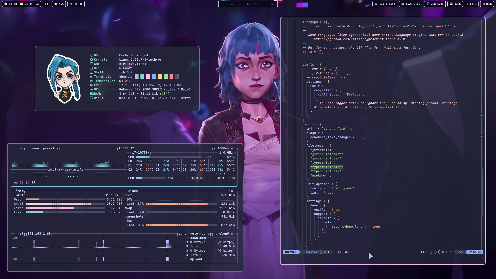
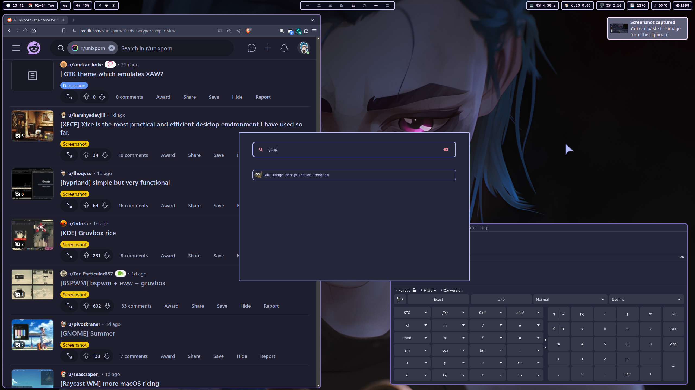

# About

<div align="center">
  This repo is a cozy home for scripts and configurations (aka .dotfiles) on my Linux setup. All tools are open-source and freely available, allowing you to use, modify, and share them as you like.
</div>

# Showcase

<div align="center">
  
</div>

<details>
  <summary>More screenshots</summary>
  <div align="center">
    
    
    
    
    
  </div>
</details>

# Dependencies

- **WM:** [Niri](https://github.com/YaLTeR/niri)
- **Bar:** [Waybar](https://github.com/Alexays/Waybar)
- **File Manager**: [Yazi](https://github.com/sxyazi/yazi) /
  [Thunar](https://gitlab.xfce.org/xfce/thunar)
- **Music Player:** [RMPC](https://github.com/mierak/rmpc) +
  [MPD](https://github.com/MusicPlayerDaemon/MPD)
- **Editor:** [Neovim](https://github.com/neovim/neovim)
- **Terminal:** [Ghostty](https://github.com/ghostty-org/ghostty)
- **Shell:** Zsh +
  [Zinit Plugin Manager](https://github.com/zdharma-continuum/zinit)
- **Lockscreen:** swaylock-fancy
- **Wallpaper Manager:** [SWWW](https://github.com/LGFae/swww)
- **Wallpapers:**
  [Link](https://github.com/somanoir/.noir-dotfiles/tree/master/.local/share/backgrounds)
- **Font:** [Maple Mono](https://github.com/subframe7536/maple-font)
- **GTK Theme:** [Catppuccin-Macchiato](https://github.com/catppuccin/gtk)
- **Qt Theme:** [Catppuccin-Macchiato](https://github.com/catppuccin/qt5ct)
- **Cursor:** [Catppuccin-Macchiato](https://github.com/catppuccin/cursors)
- **Icon Theme:**
  [Tela-circle](https://github.com/vinceliuice/Tela-circle-icon-theme)

# Installation

### Arch(-based) distros

1.1. Install Niri

```
paru -Sy --needed niri xwayland-satellite brightnessctl pavucontrol waybar ghostty wofi mako wl-clipboard copyq neovim swww swaylock-fancy-git xdg-desktop-portal-gnome mpd mpc rmpc yazi thunar thunar-archive-plugin thunar-media-tags-plugin thunar-shares-plugin thunar-vcs-plugin thunar-volman
```

1.2. Install i3

```
paru -Sy --needed i3-wm i3lock autotiling dunst maim imagemagick xdotool rofi polybar feh playerctl pavucontrol brightnessctl
```

2. Install themes and customization tools

```
paru -Sy --needed catppuccin-gtk-theme-macchiato catppuccin-cursors-macchiato maplemono-ttf maplemono-nf-unhinted maplemono-nf-cn-unhinted tela-circle-icon-theme-dracula stow nwg-look gradience qt5ct qt6ct-kde kvantum-git kvantum-qt5
```

3. Personally, I use [stow](https://www.gnu.org/software/stow/) for managing my
   .dotfiles

```
cd ~
git clone --depth 1 https://github.com/somanoir/.noir-dotfiles.git
cd .noir-dotfiles
stow .
# Possibly an overkill on setting up cursor theme
gsettings set org.gnome.desktop.interface cursor-theme 'catppuccin-macchiato-lavender-cursors'
# For bat to use specified theme
bat cache --build
```

4. Gtk-4 customization

```
sudo flatpak override --filesystem=xdg-data/themes
```

5.1. Set wallpaper on Wayland with the following command (it will later be
handled automatically on every boot as long as swww-daemon is running)

```
swww img path/to/your/wallpaper.png
```

5.2. Set wallpaper on X11 with the following command (put it into autostart of
your WM; check names of your monitors with `xrandr` and replace HDMI-0 with
them)

```
exec_always feh --bg-fill path/to/your/wallpaper.png --output HDMI-0 -z
```

6. Music Player Setup (RMPC + MPD)

```
mkdir ~/.local/share/mpd
touch ~/.local/share/mpd/database
touch ~/.local/share/mpd/playlists
touch ~/.local/share/mpd/state
touch ~/.local/share/mpd/sticker.sql

systemctl --user enable --now mpd.service

mpc update # To manually update music library
```

7. (Optional) Themes can be customized through nwg-look (GTK-3), Gradience
   (GTK-4) and kvantum, qt5ct, qt6ct (Qt)

# Communication

If you have any questions or suggestions regarding the project, feel free to
join [Discussions](https://github.com/somanoir/.noir-dotfiles/discussions).

Found a bug? Open an [Issue](https://github.com/somanoir/.noir-dotfiles/issues).
