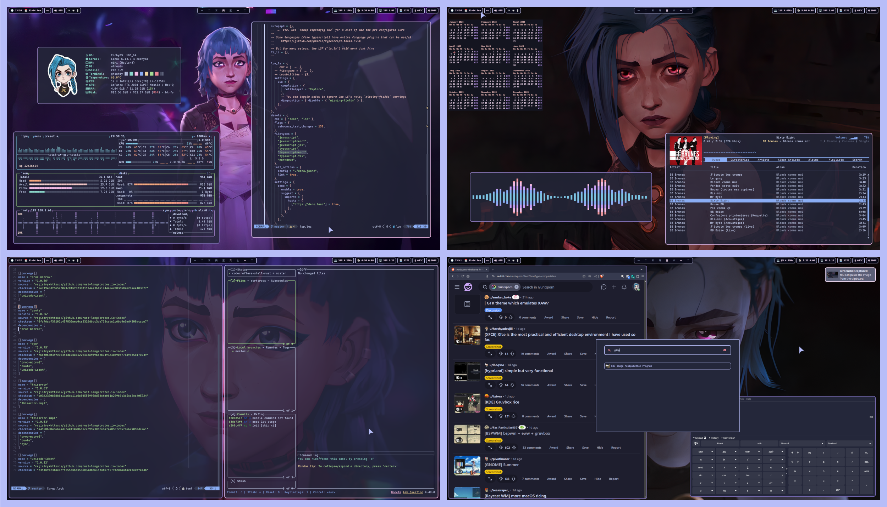
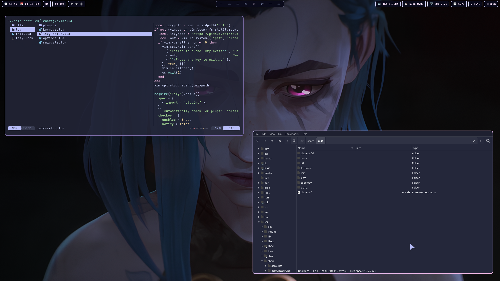

# About

<div align="center">
  This repo is a cozy home for scripts and configurations (aka .dotfiles) on my Linux setup. All tools are open-source and freely available, allowing you to use, modify, and share them as you like.
</div>

# Showcase

<div align="center">
  
</div>

<details>
  <summary>More screenshots</summary>
  <div align="center">
    
    
    
    
    
  </div>
</details>

# Dependencies

- **WM:** [Niri](https://github.com/YaLTeR/niri) /
  [Hyprland](https://github.com/hyprwm/Hyprland) /
  [i3](https://github.com/i3/i3)
- **Bar:** [Waybar](https://github.com/Alexays/Waybar)
- **File Manager**: [Yazi](https://github.com/sxyazi/yazi) /
  [Thunar](https://gitlab.xfce.org/xfce/thunar)
- **Music Player:** [RMPC](https://github.com/mierak/rmpc) +
  [MPD](https://github.com/MusicPlayerDaemon/MPD)
- **Editor:** [Neovim](https://github.com/neovim/neovim)
- **Terminal:** [Ghostty](https://github.com/ghostty-org/ghostty)
- **Shell:** Zsh +
  [Zinit Plugin Manager](https://github.com/zdharma-continuum/zinit) +
  [Starship Prompt](https://starship.rs/)
- **Lockscreen:** swaylock-fancy / hyprlock
- **Wallpaper Manager:** [SWWW](https://github.com/LGFae/swww) /
  [Feh](https://github.com/derf/feh)
- **Wallpapers:**
  [Link](https://github.com/somanoir/.noir-dotfiles/tree/master/.local/share/backgrounds)
- **Font:** [Maple Mono](https://github.com/subframe7536/maple-font)
- **GTK Theme:** [Catppuccin-Macchiato](https://github.com/catppuccin/gtk)
- **Qt Theme:** [Catppuccin-Macchiato](https://github.com/catppuccin/qt5ct)
- **Cursor:** [Catppuccin-Macchiato](https://github.com/catppuccin/cursors)
- **Icon Theme:**
  [Tela-circle](https://github.com/vinceliuice/Tela-circle-icon-theme)

# Installation

<details>
  <summary>
    <span style="font-size: 1.5em; font-weight: bold;">Arch Linux<span>
  </summary>

### Install common utilities (X11 and Wayland)

```
paru -Sy --needed brightnessctl playerctl pavucontrol alsa-utils waybar ghostty wofi mako wl-clipboard copyq neovim swww swaylock-fancy-git mpd mpc rmpc yazi thunar thunar-archive-plugin thunar-media-tags-plugin thunar-shares-plugin thunar-vcs-plugin thunar-volman tumbler dunst maim imagemagick xdotool rofi polybar feh zsh fzf uv zoxide lsd btop
```

### Install Niri

```
paru -Sy --needed niri xwayland-satellite xdg-desktop-portal-gnome
```

### Install Hyprland

```
paru -Sy --needed hyprland hyprpicker pyprland hyprpolkitagent hyprshot xdg-desktop-portal-hyprland hyprlock
```

### Install i3

```
paru -Sy --needed i3-wm i3lock autotiling
```

### Install themes and customization tools

```
paru -Sy --needed catppuccin-gtk-theme-macchiato catppuccin-cursors-macchiato tela-circle-icon-theme-dracula stow nwg-look
```

### Install recommended fonts

```
paru -Sy --needed maplemono-ttf maplemono-nf-unhinted maplemono-nf-cn-unhinted gnu-free-fonts noto-fonts ttf-bitstream-vera ttf-croscore ttf-dejavu ttf-droid ttf-ibm-plex ttf-liberation wqy-zenhei ttf-mona-sans apple-fonts ttf-ms-fonts nerd-fonts
```

</details>

<details>
  <summary>
    <span style="font-size: 1.5em; font-weight: bold;">Fedora<span>
  </summary>

### Enable COPR repos

```
sudo dnf copr enable lihaohong/yazi
sudo dnf copr enable yalter/niri
dnf install --nogpgcheck --repofrompath 'terra,https://repos.fyralabs.com/terra$releasever' terra-release
```

### Install common utilities (X11 and Wayland)

```
sudo dnf install zsh fzf uv zoxide lsd bat brightnessctl playerctl pavucontrol alsa-utils waybar ghostty wofi mako copyq neovim swww mpd mpc thunar yazi dunst maim xdotool rofi polybar feh ImageMagick meson btop
```

### Install Niri

```
sudo dnf install niri xwayland-satellite xdg-desktop-portal-gnome
```

### These will need to be built from source if you want to use them (follow corresponding instructions)

[RMPC (music player)](https://mierak.github.io/rmpc/next/installation/#installation-methods)

### Install recommended fonts

```
sudo dnf install maple-fonts
```

</details>

### Personally, I use [stow](https://www.gnu.org/software/stow/) for managing my .dotfiles

```
cd ~
git clone --depth 1 https://github.com/somanoir/.noir-dotfiles.git
cd .noir-dotfiles
stow .

# Possibly an overkill on setting up cursor theme
gsettings set org.gnome.desktop.interface cursor-theme 'catppuccin-macchiato-lavender-cursors'
# For bat to use specified theme
bat cache --build
```

### Gtk-4 customization

```
sudo flatpak override --filesystem=xdg-data/themes
```

### Set wallpaper

On Wayland: with the following command (it will later be handled automatically
on every boot as long as swww-daemon is running)

```
swww img path/to/your/wallpaper.png
```

On X11: with the following command (put it into autostart of your WM; check
names of your monitors with `xrandr` and replace HDMI-0 with them)

```
feh --bg-fill path/to/your/wallpaper.png --output HDMI-0 -z
```

### Music Player Setup (RMPC + MPD)

```
mkdir ~/.local/share/mpd
touch ~/.local/share/mpd/database
mkdir ~/.local/share/mpd/playlists
touch ~/.local/share/mpd/state
touch ~/.local/share/mpd/sticker.sql

systemctl --user enable --now mpd.service

mpc update # To manually update music library
```

### (Optional) Themes can be customized through nwg-look (GTK-3), Gradience (GTK-4) and kvantum, qt5ct, qt6ct (Qt)

# Known Issues

> Qt themes seem to behave unpredictably outside KDE Plasma (inconsistent
> background color, broken buttons and menus, etc). Might be worth leaving them
> with default styles.

# Communication

If you have any questions or suggestions regarding the project, feel free to
join [Discussions](https://github.com/somanoir/.noir-dotfiles/discussions).

Found a bug? Open an [Issue](https://github.com/somanoir/.noir-dotfiles/issues).
